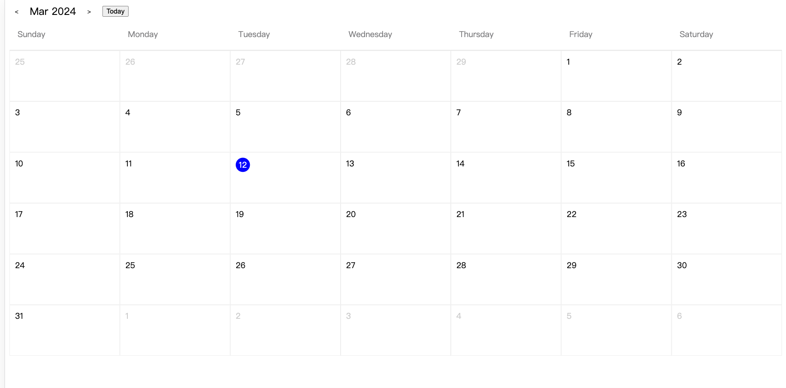

# 日历组件 Calendar

使用*react*实现的日历组件

# 如何使用

依赖安装

```sh
pnpm i
```

启动项目

```sh
pnpm start
```

打包

```sh
pnpm build
```

示例

```tsx
import Calendar from "@/component/Calendar";
import dayjs from "dayjs";

<Calendar
  onChange={(date) => {
    console.log(date.format("YYYY-MM-DD"));
  }}
  locale="en-US"
/>;
```

# 效果预览

[在线预览](https://xiaoheimiaomiao.github.io/calendar-component/)



# 参数说明

| 参数             | 说明                                      |                  类型                   |   默认值 |
| :--------------- | :---------------------------------------- | :-------------------------------------: | -------: |
| value            | 展示日期                                  |                  dayjs                  | 当前时间 |
| onChange         | 选择日期后的回调                          |        `(value: Dayjs) => void`         |        - |
| locale           | 国际化                                    |             en-US \| zh-CN              |    en-US |
| dateRender       | 自定义单元格，返回内容覆盖单元格          | (currentDate: Dayjs) => React.ReactNode |        - |
| dateInnerContent | 自定义单元格，内容会被添加到单元格内      | (currentDate: Dayjs) => React.ReactNode |        - |
| className        | 日历组件外层 classname 会与 calendar 合并 |                 string                  |        - |
